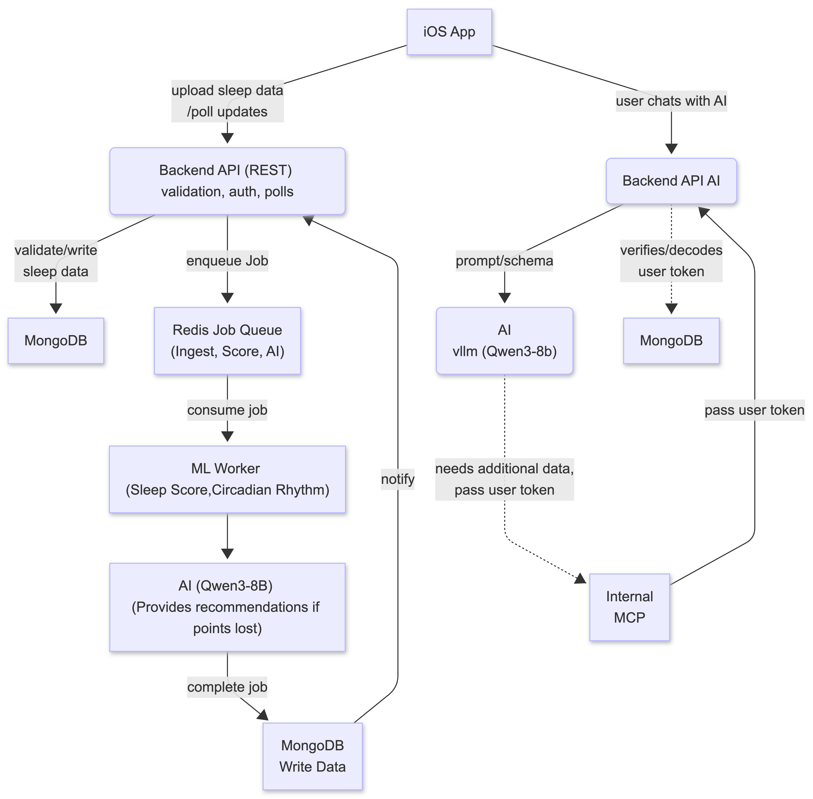
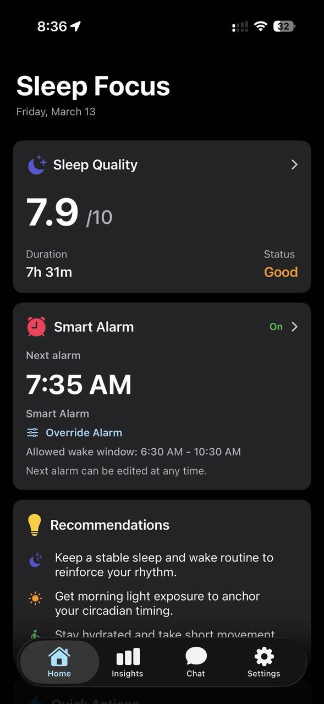

# SleepFocus

SleepFocus is a wellness app focusing on sleep health for students and professionals through data- driven insights. Using wearable technologies, our app delivers smart alarms, sleep analysis, and AI-powered recommendations to support healthier daily productivity.

This repository holds the server-side orchestration entrypoint for SleepFocus.  
It defines how backend services, model services, queues, and data stores run together.

Internal implementation repositories are not public. This repo keeps the integration surface (compose, scripts, architecture assets), while core backend/model internals live in private repos.

## Architecture Diagram

### 1) Client-Side
- **iOS App** [SleepFocus_Frontend](https://github.com/SleepFocus/SleepFocus_Frontend)
- Sends sleep uploads and status polling requests to the REST backend.
- Sends chat messages to the AI backend.

### 2) Scoring Module (left side of diagram)
- **Backend API (REST)**: validation, auth, ingest endpoints, and polling.
- **MongoDB (ingest store)**: validated sleep/biometric data persistence.
- **Redis Job Queue**: async pipeline jobs (`ingest`, `score`, `AI`).
- **ML Worker**: consumes queued jobs for sleep scoring and circadian processing.
- **AI Recommender (Qwen3-8B)**: generates recommendations when scoring signals loss points.
- **MongoDB Write Data**: stores completed pipeline outputs and notifies backend status.

### 3) Conversational AI Module (right side)
- **Backend API AI**: chat-facing API layer.
- **MongoDB (AI/auth side)**: token/user verification data used by AI endpoints.
- **AI Runtime (vLLM / Qwen3-8B)**: prompt/schema execution for responses.
- **Internal MCP**: internal tool context bridge used when model calls need additional user-scoped data.

### 4) Scoped Data Access
- User token is passed from AI backend to internal MCP for scoped context access.
- AI module can request additional data from internal systems before final response generation.

## Related Repositories

This repository provides a project overview and serves as the **server integration layer** (compose, scripts, and architecture assets), not the full product code.

Related repositories in this workspace:

- [**`SleepFocus_Backend_v2`**](https://github.com/SleepFocus/SleepFocus_Backend_v2): TypeScript REST API + worker pipeline orchestration.
- [**`SleepFocus_Model_v3`**](https://github.com/SleepFocus/SleepFocus_Model_v3): Python modeling pipeline, scoring/circadian logic, labeling tooling, and model API.
- [**`SleepFocus_Frontend`**](https://github.com/SleepFocus/SleepFocus_Frontend): SwiftUI iOS app and widget client.
- [**`SleepFocus_Icon`**](https://github.com/SleepFocus/SleepFocus_Icon): app icon source assets and exports.

## Application Images

